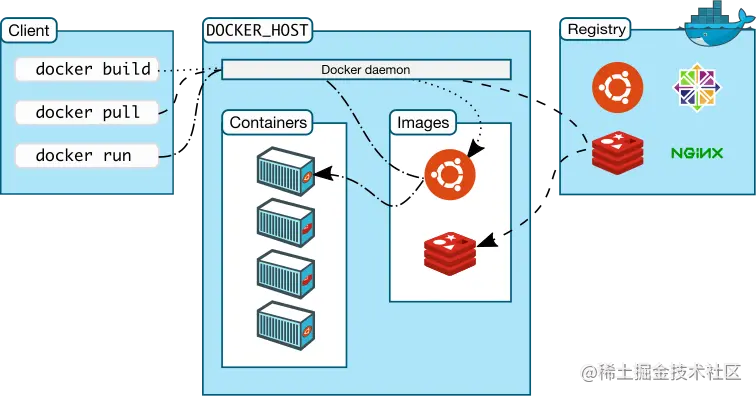
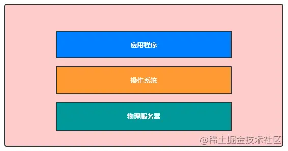
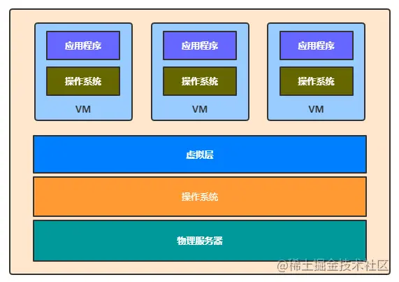
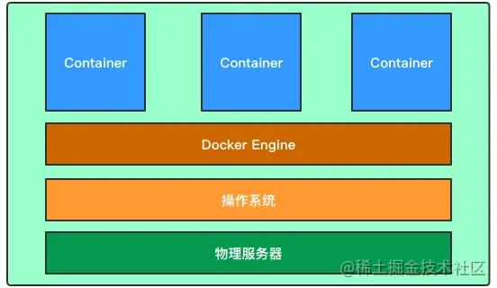
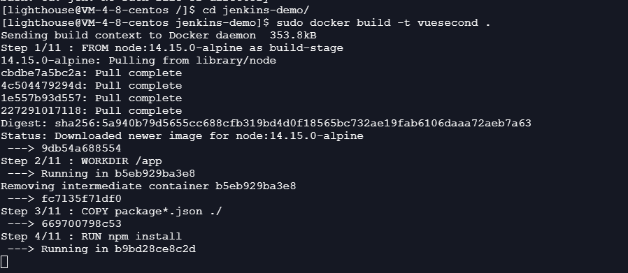
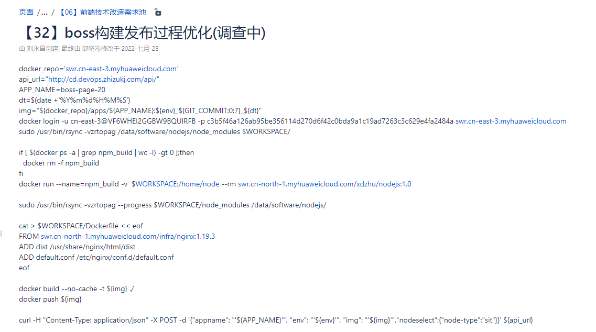
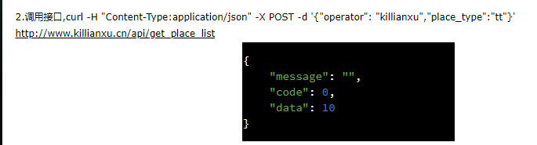
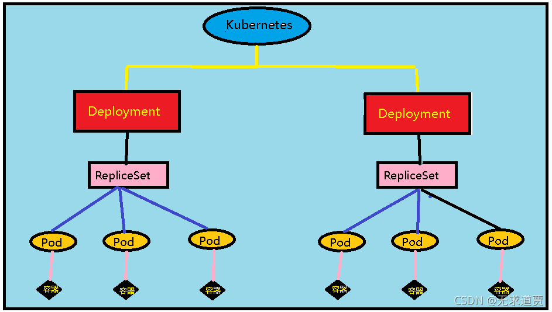
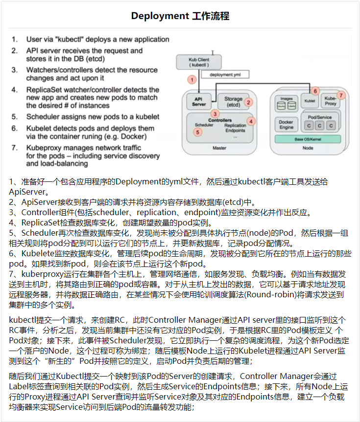

一门新技术的出现，是为了解决当前的痛点。

一门新技术的出现，在解决以前问题的同时也会引进复杂性。

## Docker 产生的背景
提高资源的利用率，实现分布式的计算。云计算的核心即虚拟化和分布式，利用 Docker 我们可以在多台服务器轻松地扩展应用。我们所熟知的虚拟机 VMWare 即一种虚拟化技术，VMWare 建立在操作系统之上，并且 VMWare 内部可以运行多个应用。

但 VMWare 本身会占用一定的机器资源，对硬件是有损耗的。而我们接下来要学习的 Docker 则是一种容器虚拟化技术，即轻量级的虚拟化，每一个 Docker 实例直接运行在操作系统之上，相当于操作系统的一个应用，因此不会额外消耗硬件资源，能更充分地利用操作系统的特性和机制。

DevOPS 即研发和运维一体化，自动化创建和部署的需求。Docker 产生的另一个背景即研发和运维一体化，实现软件的更快交付和部署，更高效的资源利用，更轻松的迁移以及更简单的更新管理（使用 DockerFile 配置文件增量更新和分发）。


## 1.what
Docker 是一个开源的应用容器引擎，基于 Go 语言（Google 开发的一款语言）

Docker 属于 Linux 容器的一种封装，提供简单易用的容器使用接口。它是目前最流行的 Linux 容器解决方案。

Docker 将应用程序与该程序的依赖，打包在一个文件里面。运行这个文件，就会生成一个虚拟容器。程序在这个虚拟容器里运行，就好像在真实的物理机上运行一样。有了 Docker，就不用担心环境问题。

总体来说，Docker 的接口相当简单，用户可以方便地创建和使用容器，把自己的应用放入容器。容器还可以进行版本管理、复制、分享、修改，就像管理普通的代码一样。

### docker 的用途
Docker 的主要用途，目前有三大类。
* 1.提供一次性的环境。比如，本地测试他人的软件、持续集成的时候提供单元测试和构建的环境。
* 2.提供弹性的云服务。因为 Docker 容器可以随开随关，很适合动态扩容和缩容。
* 3.组建微服务架构。通过多个容器，一台机器可以跑多个服务，因此在本机就可以模拟出微服务架构。

### docker三大核心
* 镜像 image ：类似于虚拟机镜像，只读模板。
* 容器 Container ：轻量级的沙箱，运行的实例；相当于简易的 Linux 环境，在镜像上创建的可写层。
* 仓库 Respository ：Docker 集中存放镜像文件的场所，分为公有仓库和私有仓库，类似于 GitHub ，使用 push 上传，使用 pull 下载。

### docker 架构图


从图中可以看出几个组成部分
* docker client: 即 docker 命令行工具
* docker host: 宿主机，docker daemon 的运行环境服务器
* docker daemon: docker 的守护进程，docker client 通过命令行与 docker daemon 交互
* image: 镜像，可以理解为一个容器的模板，通过一个镜像可以创建多个容器
* container: 最小型的一个操作系统环境，可以对各种服务以及应用容器化，是镜像的运行实例
* registry: 镜像仓库，存储大量镜像，可以从镜像仓库拉取和推送镜像

## 2.why

### 没有虚拟化技术的原始年代
Q:我们仔细想想，在没有计算虚拟化技术的“远古”年代，如果我们要部署一个应用程序(Application)，一般的步骤是怎么样的？

A:第一步肯定是先要准备一台物理服务器，然后在物理服务器上安装一个操作系统(Operating System)，有了操作系统之后，便在操作系统上安装运行我们的应用程序



那么，这种方式有什么问题呢？其实，在物理机上部署应用有以下几个缺点：
* 部署非常慢：因为我们得先准备硬件服务器，接着还要安装操作系统，然后再部署应用程序，而且应用程序还有很多的依赖软件，所以这个过程是比较慢的。
* 成本非常高：主要是物理器成本太高，即使是部署一个简单的应用，也需要一台服务器。
* 资源浪费：如果应用太简单，也容易浪费硬件资源，比如CPU和内存
* 迁移和扩展太慢：如果需要迁移应用，或者扩展应用，都要再准备其他的物理服务器，过程很麻烦，也很慢。

那么有什么办法可以解决这些问题呢？答案便是虚拟化技术。

### 使用虚拟机部署应用程序的年代

谈到计算机的虚拟化技术，我们直接想到的便是虚拟机，虚拟机允许我们在一台物理计算机模拟出多台机器,简单地理解，虚拟化技术就是在一台物理计算机上，通过中间虚拟软件层Hypervisor隔离CPU、内存等硬件资源，虚拟出多台虚拟服务器，这样做的话，一台物理服务器便可以安装多个应用程序，达到资源利用的最大化，而且多个应用之间相互隔离。




虚拟机的优点
* 可以把资源分配到不同的虚拟机，达到硬件资源的最大化利用
* 与直接在物理机上部署应用，虚拟机更容易扩展应用。
* 云服务:通过虚拟机虚拟出不同的物理资源，可以快速搭建云服务。

虚拟机的不足之处:
虚拟机的不足之处在于对物理服务器资源的消耗，当我们在物理服务器创建一台虚拟机时，便需要虚拟出一套硬件并在上面运行完整的操作系统(笨重)，每台虚拟机都占用许多的服务器资源。

### Linux 容器
由于虚拟机存在这些缺点，Linux 发展出了另一种虚拟化技术：Linux 容器（Linux Containers，缩写为 LXC）。

Docker是容器技术的一种实现，容器一词的英文是container，其实container还有集装箱的意思，docker可以屏蔽环境差异，也就是说，只要你的程序打包到了docker中，那么无论运行在什么环境下程序的行为都是一致的，程序员再也无法施展表演才华了，不会再有“在我的环境上可以运行”，真正实现“build once, run everywhere”

Linux 容器不是模拟一个完整的操作系统，而是对进程进行隔离。或者说，在正常进程的外面套了一个保护层。对于容器里面的进程来说，它接触到的各种资源都是虚拟的，从而实现与底层系统的隔离。

由于容器是进程级别的，相比虚拟机有很多优势。

* 1.启动快
  容器里面的应用，直接就是底层系统的一个进程，而不是虚拟机内部的进程。所以，启动容器相当于启动本机的一个进程，而不是启动一个操作系统，速度就快很多。
* 资源占用少
  容器只占用需要的资源，不占用那些没有用到的资源；虚拟机由于是完整的操作系统，不可避免要占用所有资源。另外，多个容器可以共享资源，虚拟机都是独享资源。
* 体积小
  容器只要包含用到的组件即可，而虚拟机是整个操作系统的打包，所以容器文件比虚拟机文件要小很多。

总之，容器有点像轻量级的虚拟机，能够提供虚拟化的环境，但是成本开销小得多。



Docker VS 虚拟化：
|  特性   | 容器  | 虚拟机  |
|  ----  | ----  | ----  |
| 启动速度  | 秒级 | 分钟级 |
| 硬盘空间  | MB |GB（含有操作系统的部分） |
| 性能  | 接近原生 |10%的损失 |
| 系统支持数量  | 单机上千个 |一般几十个 |
| 隔离性  | 安全隔离 |完全隔离 |

## 3.how

### 安装
[docker安装](https://blog.csdn.net/weixin_40357154/article/details/123398978)

### docker 常用命令
docker hello-world
```Bash
# docker输出 hello world
#将 image 文件从仓库抓取到本地。
docker image pull library/hello-world
# 上面代码中，docker image pull是抓取 image 文件的命令。library/hello-world是 image 文件在仓库里面的位置，其中library是 image 文件所在的组，hello-world是 image 文件的名字。
# 抓取成功以后，就可以在本机看到这个 image 文件了。
docker image ls
# 现在，运行这个 image 文件。
docker run hello-world
# Hello from Docker!
# This message shows that your installation appears to be working correctly.
#  输出这段提示以后，hello world就会停止运行，容器自动终止。
```

docker 使用Jenkins
``` Bash
# 先下载jenkins镜像Docker Hub,选择lts的jenkins最新版本
docker pull jenkins/jenkins:lts
# 新建jenkins用户的工作目录，注意这一步最好目录保持一致。
mkdir /home/jenkins
# 查看目录归属ID命令 ls -nd /home/jenkins ,这里查看ID是1000
ls -nd /home/jenkins
# 给ID为1000的用户添加操作权限
chown -R 1000:1000 /home/jenkins
# 运行容器
docker run -itd -p 9090:8080 -p 50000:50000 --name jenkins --privileged=true -v /home/jenkins:/var/jenkins_home jenkins/jenkins:lts
# --privileged=true 让容器有root权限，方便进入容器操作
# -p 9090:8080 jenkins的web访问端口9090
# -v /home/jenkins:/var/jenkins_home 容器/var/jenkins_home路径映射到宿主机/home/jenkins
# 浏览器输入http://43.142.83.176:9090/访问jenkins首页
```
常用命令

[Docker常用命令大全](https://www.jianshu.com/p/b471bd718504)
```Bash
# 查看docker版本
sudo docker -v
# 查看本地所有顶层镜像（top level）信息的命令，按照创建时间倒序展示 
docker images
# 拉取镜像
docker pull
# 根据name和tag拉取镜像
docker pull name:tag
# 移除镜像
docker rmi
docker rmi name:tag
docker rmi -f image_ID 来进行删除
# 构建镜像
docker build
# 容器命令
# 查看容器命令
docker ps
# 查看容器的运行情况资源占用情况
docker stats
```

### 多阶段构建部署vue前端项目

[多阶段构建部署vue前端项目](https://www.pudn.com/news/62a59aa1194b3b0e4351fc10.html)

docker build -t vuesecond . 



```Bash
# dockerfile
# build stage
#使用14.15.0的node版本作为运行软件
FROM node:14.15.0-alpine as build-stage
#将此目录作为工作目录
WORKDIR /app
#复制本目录下的package文件（源文件）到工作目录（目标目录）
COPY package*.json ./
#在工作目录执行npm install 
RUN npm install
#将本本录下所有文件复制到目标目录
COPY . .
RUN npm run build

# production stage
FROM nginx:stable-perl as production-stage
COPY --from=build-stage /app/dist /usr/share/nginx/html
COPY --from=build-stage /app/default.conf /etc/nginx/conf.d/default.conf
EXPOSE 80
CMD ["nginx", "-g", "daemon off;"]
```
### 制作 Dockerfile

[制作 Dockerfile](https://www.cnblogs.com/vincent-c/articles/15380181.html)

### zz CICD 过程


```Bash

1.git 凭证拉代码 (/data/jenkins/workspace/业务云/new-boss-page/)

2.执行.sh 文件(docker文件)

# 登录docker仓库
docker login -u cn-east-3@VF6WHEI2GGBW9BQUIRFB -p c3b5f46a126ab95be356114d270d6f42c0bda9a1c19ad7263c3c629e4fa2484a swr.cn-east-3.myhuaweicloud.com

# rsync rsync是linux系统下的数据镜像备份工具.
# rsync算法并不是每一次都整份传输，而是只传输两个文件的不同部分，因此其传输速度相当快。
# 本地    rsync   选项       源      目标
# Local:  rsync [OPTION...] SRC... [DEST]
# -v：–verbose 复杂的输出信息。
# -z：–compress 压缩模式，当资料在传送到目的端进行档案压缩。
# -r：–recursive 复制所有下面的资料，递归处理。
# -t：–times 保留时间点，文件原有时间。
# -o：–owner 保留档案所有者(root only)。
# -p：–perms 保留档案权限，文件原有属性。
# -a：–archive archive mode 权限保存模式，相当于 -rlptgoD 参数，存档，递归，保持属性等。
# -g：–group 保留原有属组。
sudo /usr/bin/rsync -vzrtopag /data/software/nodejs/node_modules $WORKSPACE/
sudo /usr/bin/rsync -vzrtopag /data/software/nodejs/node_modules /data/jenkins/workspace/业务云/new-boss-page/

# docker ps -a 显示所有的容器，包括未运行的
# grep  搜索 查找
# wc -l 文件总个数
# -gt 大于
# rm -f 强制删除
if [ $(docker ps -a | grep npm_build | wc -l) -gt 0 ];then
  docker rm -f npm_build
fi

# docker run [OPTIONS] IMAGE [COMMAND] [ARG...]
# 创建一个新的容器并运行一个命令
# docker run --name 启动容器为容器指定一个名称
# -v 绑定一个卷
# 设置 --rm 选项，这样在容器退出时就能够自动清理容器内部的文件系统。
docker run --name=npm_build -v  $WORKSPACE:/home/node --rm swr.cn-north-1.myhuaweicloud.com/xdzhu/nodejs:1.0

# 图片 和 其他类型资源被忽略
Images and other types of assets omitted.
# $WORKSPACE/node_modules 同步到  /data/software/nodejs/下
# 同步的都是.cache 缓存文件
sudo /usr/bin/rsync -vzrtopag --progress $WORKSPACE/node_modules /data/software/nodejs/

# 用来创建文件，在这之后输入的内容都放到文件中，直到EOF结束
cat > $WORKSPACE/Dockerfile << eof
FROM swr.cn-north-1.myhuaweicloud.com/infra/nginx:1.19.3
ADD dist /usr/share/nginx/html/dist
ADD default.conf /etc/nginx/conf.d/default.conf
eof

# 创建镜像的过程不使用缓存
# -t: 镜像的名字及标签
docker build --no-cache -t ${img} ./

# 将本地的镜像上传到镜像仓库,要先登陆到镜像仓库
docker push ${img}

# curl(CommandLine Uniform Resource Locator)，即在命令行中利用URL进行数据或者文件传输。它是一款很强大的http命令行工具，支持文件的上传和下载，是综合传输工具，按传统习惯称curl为下载工具。

curl -H "Content-Type: application/json" -X POST -d '{"appname": "'${APP_NAME}'", "env": "'${env}'", "img": "'${img}'","nodeselect":{"node-type":"sit"}}' ${api_url}

${api_url} : http://cd.devops.zhizukj.com/api/
```


## 容器编排(docker-compose、k8s)



### 容器编排诞生的背景

由于应用程序日益激增的复杂度，以及其他种种原因，微服务架构逐渐兴起。而微服务的兴起也使得容器的使用量大幅度提升，这是因为微服务框架把一个大型的单体应用程序拆分解耦成立众多小型独立的微服务应用，而容器恰恰是装载部署这些小型微服务的最佳实现方式。

微服务和容器的兴起又进一步使得一些应用程序由数百甚至数千个容器组成，这个时候对众多容器的管理就成为了巨大的挑战。使用脚本和自制的工具跨多个环境来管理这些容器是非常复杂的，有时候对于某些场景来说甚至是不可能的，这最终产生了对容器编排技术的需求。

### 容器编排怎么工作的？

当你使用容器编排工具，比如 Kubernetes，你需要使用YAML 或 JSON 文件来描述应用程序配置。该配置文件会告知配置管理工具哪里下载容器镜像，怎么设置网络，日志存在哪。

在部署新容器时，容器管理工具会根据定义好的配置和限制，调度deployment到集群，配置到正确的主机上。编排工具基于compose文件内指定的配置管理容器的生命周期。

你可以使用 Kubernetes patterns 来管理配置，生命周期，基于容器的应用和服务的扩展。这些可重复使用的 patterns 是Kubernetes 开发用来构建整个系统的工具。

容器编排可以在运行容器的任何环境使用，不管是本地环境还是共有云或私有云环境。



## 参考链接

- [Docker必备基础知识](https://juejin.cn/post/6844903918372143112)

- [docker安装](https://blog.csdn.net/weixin_40357154/article/details/123398978)

- [多阶段构建部署vue前端项目](https://www.pudn.com/news/62a59aa1194b3b0e4351fc10.html)
  
- [Docker 入门教程](http://www.ruanyifeng.com/blog/2018/02/docker-tutorial.html)

- [写给前端的 docker 极简入门](https://juejin.cn/post/7103903128700846088) 

- [从零搭建docker+jenkins+node.js自动化部署环境](https://juejin.cn/post/6844903669381464071)


