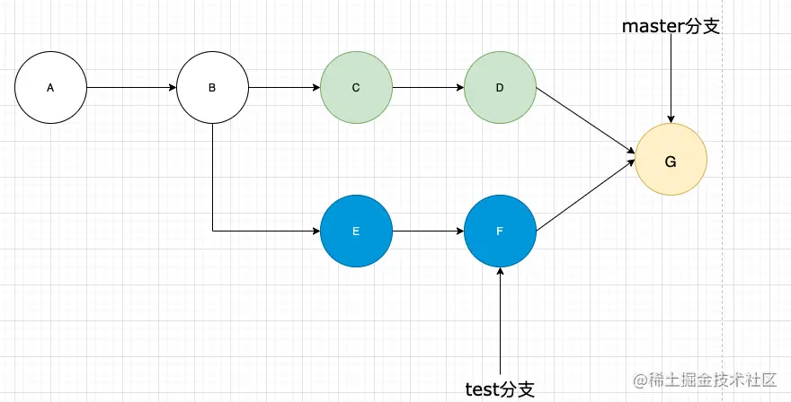
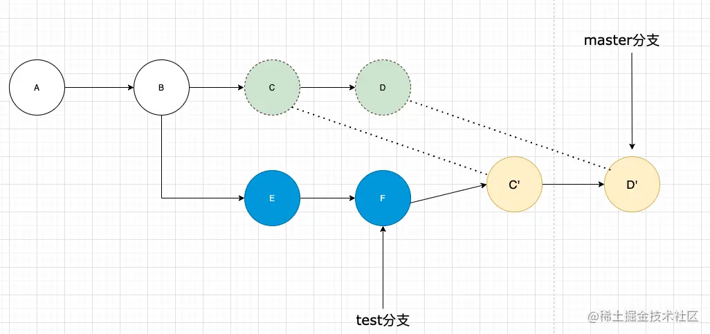

## git merge实现

我们有两个分支，master 分支和 test 分支，test 分支是基于 master 分支在B处的提交节点创建的，在创建后 master 分支又经过迭代提交了两次，从C到D节点，test 分支也基于B往前继续更新了两次，到了F节点。两者从B开始就走向了分叉

这时如果我们想将 test 分支合并到 master 分支，通过 merge 是如何工作的呢？

```git
//将分支切换到master分支
git checkout master
​
//把test分支合并到master分支
git merge test
```



从图中可以看到，这里生成了一个新的提交G，是怎么生成的呢？ merge 命令 它会把两个分支的最新快照（F、E 和 D、C）以及二者最近的共同祖先（B）进行三方合并，合并的结果是生成一个新的快照G（并提交）。

## git rebase实现

```Bash
//将分支切换到master分支
git checkout master
​
//把test分支合并到master分支
git rebase test
```



从图就可以看出和 merge 命令不同

这里有个名词定义我们先简单说明一下
* test:基分支、目标分支
* master: 待变基分支，当前分支

官方解释： 当执行 rebase 操作时，git 会从两个分支的共同祖先开始提取待变基分支上的修改，然后将待变基分支指向基分支的最新提交，最后将刚才提取的修改应用到基分支的最新提交的后面。

我们结合具体例子来说明，当我们在master (待变基分支)上执行git rebase test(基分支)时,git就会从两者的共同祖先B开始，提取 master 分支上的修改，也就是 C,D 两个 commit ,提取到之后 git 会先保存起来，然后将master 分支指向 test 分支最新提交的节点，也就是F节点，然后把提取到的 C,D 接到F后面，在这个过程当中，会删除原来的C,D commit 记录，生成新的C‘，D'，虽然C',D'和原来的C,Dcoommit的内容是一样的，但是 commit id 是不同的。

rebase 操作如果用一句话进行解释就是改变基底。master 分支原来的基底是A，现在变成了以 test 分支最新的提交F做为新的基底了。


