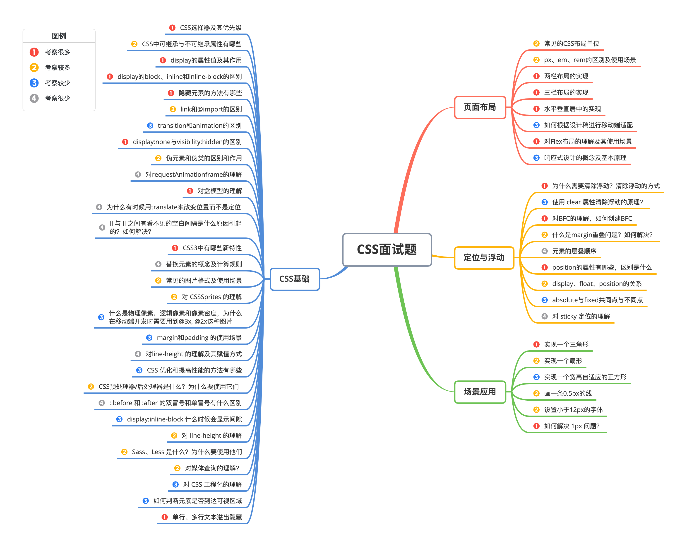
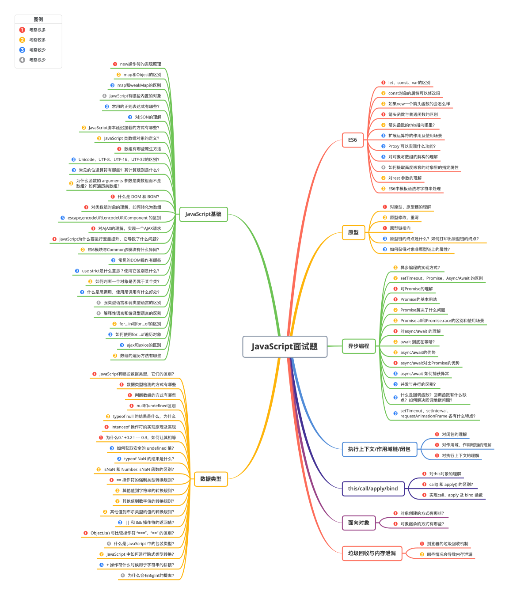
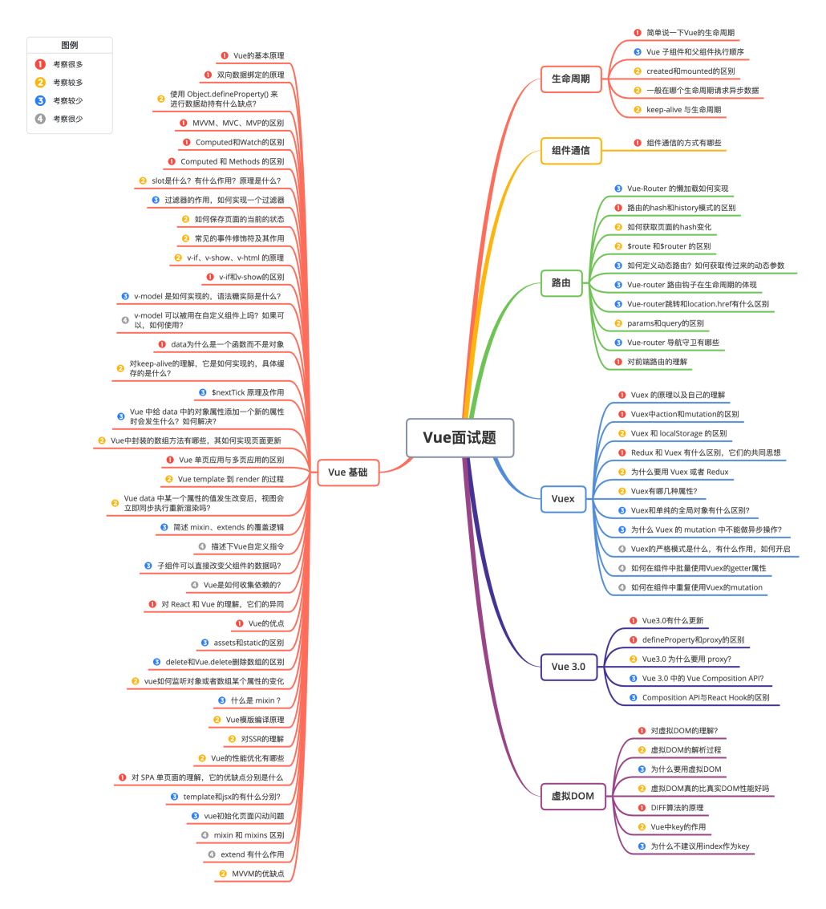
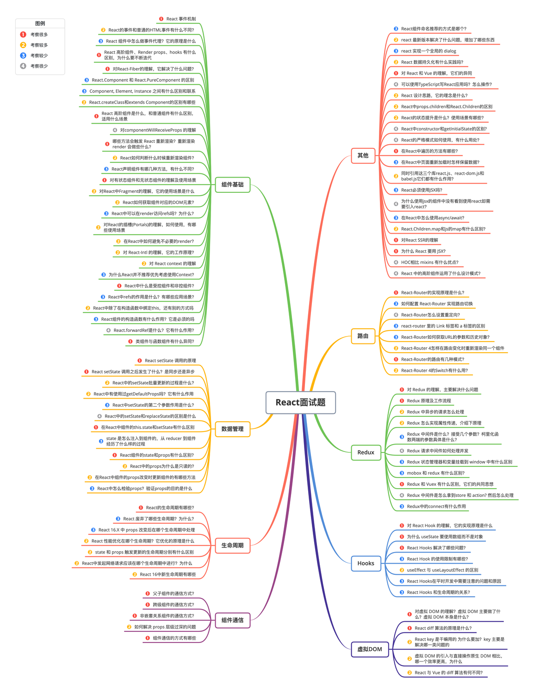
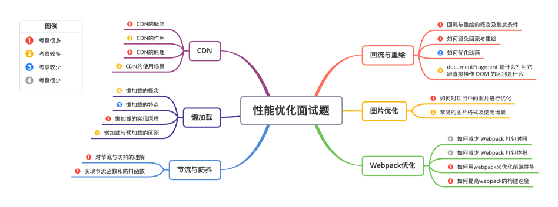
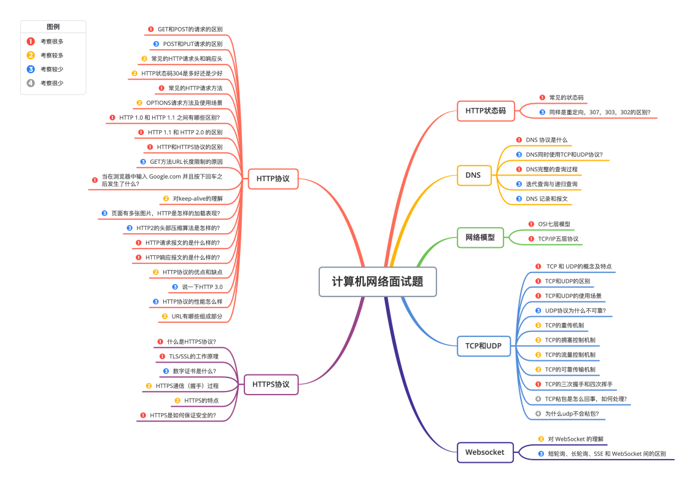
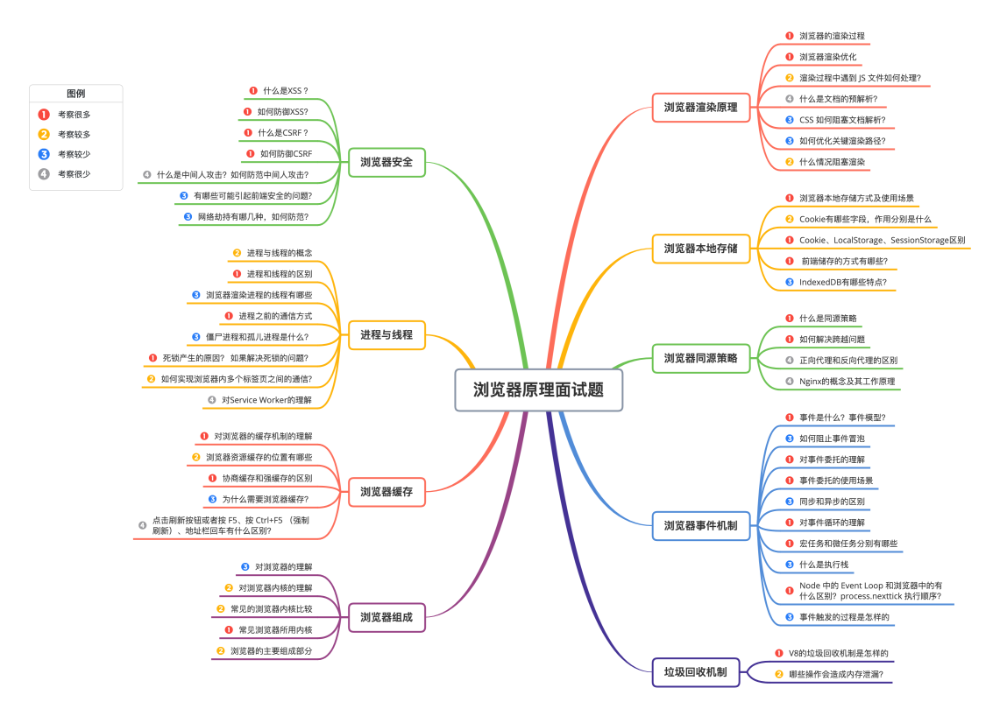

# 面试相关

## css相关问题

Q:align-items和align-content的区别
A:flex-wrap 形成多条轴线，align-items会使得项目在各自的轴线上对齐，而align-content会使得所有内容（多行内容）作为一个整体在整个容器上对齐。

[答案](https://www.likecs.com/show-204781057.html)

[互联网大厂面试每日一题](https://q.shanyue.tech/)

