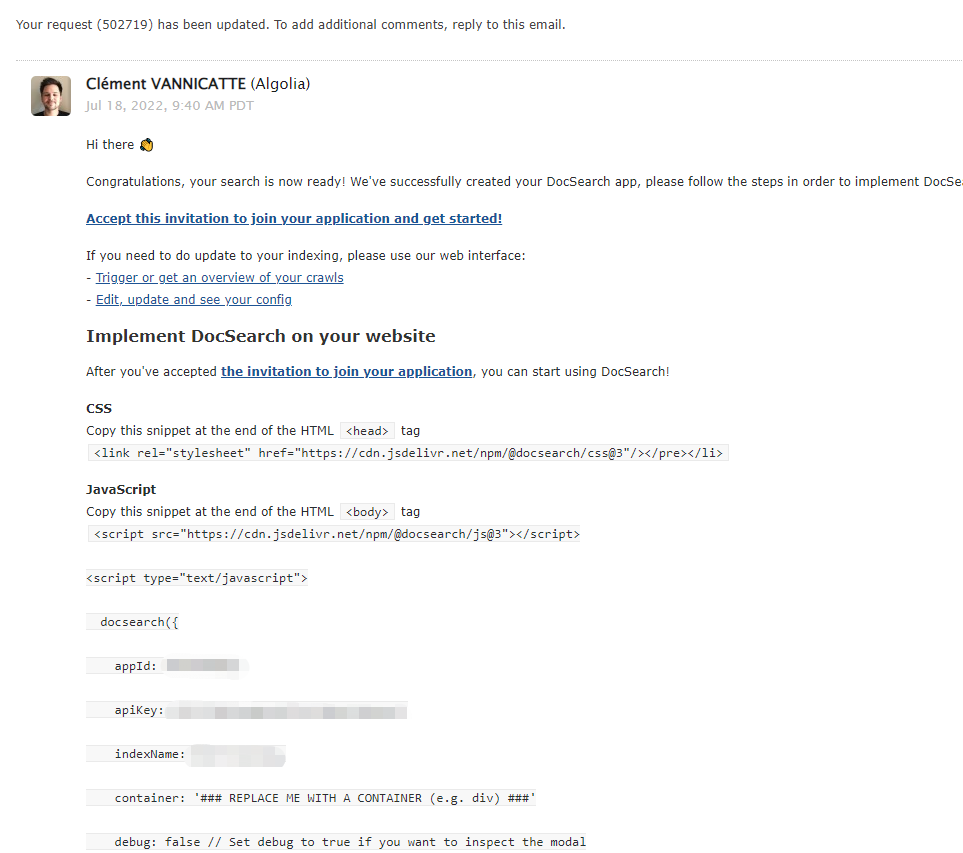
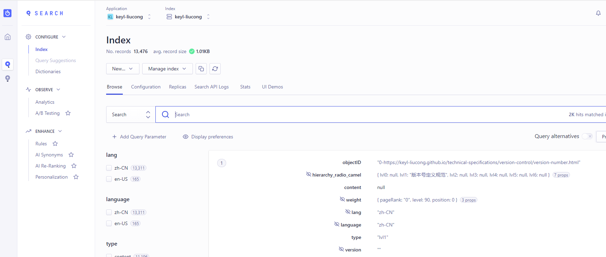

# docsearchPlugin插件使用

## 需求背景

搭建博客之后需要搜索功能，调研之后发现Algolia 搜索插件不错。VuePress 官方文档就有 Algolia 搜索插件，可以直接安装使用，使用 Algolia 搜索最大的好处就是方便，它会自动爬取网站的页面内容并构建索引，你只用申请一个 Algolia 授权服务，在网站上添加一些代码，就可以像添加统计代码一样，实现一个全文搜索功能了。


## 使用步骤

### 1.先申请授权，获取apiId、apiKey、indexName
申请地址: [docsearch](https://docsearch.algolia.com/apply/)


打开后填写网站地址、邮箱和仓库地址等信息，然后勾选上下面三项，并提交。之后就静待邮件，一般两三天就都会有回复的。

注意： 如果你没有注册过账号，这里官网会用这个邮箱帮你注册账号，且网站需要是公开可访问的 如果你网站不是他们要求的类型的，可以先搭建个文档类型的再进行申请。

如果申请通过，我们就会收到邮件，内容如下：

官方邮箱地址：support@algolia.com


根据文中内容，回复确认你是站长网站的维护者并可以更改代码并简单说明要用 DocSearch 产品即可，之后就会得到官方发送的 AppID 等信息，内容如下：



通过 文中的邀请链接，就可以设置密码，然后用你的邮箱登录就可以了。我这里是用github账号注册登录的，[algolia 登录页](https://crawler.algolia.com/admin)

### 2.实施部署

我这里使用的是vuepress-theme-hope主题，主题使用[docsearchPlugin介绍](https://vuepress-theme-hope.github.io/v2/zh/guide/feature/search.html#%E4%BD%BF%E7%94%A8-vuepress-plugin-docsearch)，安装相关配置参考以上文档。

为了正常的使用插件，你需要按照下列要求正确设置 Algolia Crawler。 前往 Algolia Crawler 来更新你的爬虫配置。

::: details 配置爬虫

以下是配置选项和说明:

```bash
new Crawler({
  appId: "YOUR_APP_ID",
  apiKey: "YOUR_API_KEY",
  rateLimit: 8,
  startUrls: [
    // 这是 Algolia 开始抓取网站的初始地址
    // 如果你的网站被分为数个独立部分，你可能需要在此设置多个入口链接
    "https://YOUR_WEBSITE_URL/",
  ],
  sitemaps: [
    // 如果你在使用 Sitemap 插件 (如: vuepress-plugin-sitemap2)，你可以提供 Sitemap 链接
    "https://YOUR_WEBSITE_URL/sitemap.xml",
  ],
  ignoreCanonicalTo: false,
  exclusionPatterns: [
    // 你可以通过它阻止 Algolia 抓取某些 URL
  ],
  discoveryPatterns: [
    // 这是 Algolia 抓取 URL 的范围
    "https://YOUR_WEBSITE_URL/**",
  ],
  // 爬虫执行的计划时间，可根据文档更新频率设置
  schedule: "at 02:00 every 1 day",
  actions: [
    // 你可以拥有多个 action，特别是你在一个域名下部署多个文档时
    {
      // 使用适当的名称为索引命名
      indexName: "YOUR_INDEX_NAME",
      // 索引生效的路径
      pathsToMatch: ["https://YOUR_WEBSITE_URL/**"],
      // 控制 Algolia 如何抓取你的站点
      recordExtractor: ({ $, helpers }) => {
        // 以下是适用于 vuepress-theme-hope 的默认选项选项
        // vuepress-theme-hope 默认的容器类名为 theme-hope-content
        return helpers.docsearch({
          recordProps: {
            lvl0: {
              selectors: ".sidebar-heading.active",
              defaultValue: "Documentation",
            },
            lvl1: ".theme-hope-content h1",
            lvl2: ".theme-hope-content h2",
            lvl3: ".theme-hope-content h3",
            lvl4: ".theme-hope-content h4",
            lvl5: ".theme-hope-content h5",
            lvl6: ".theme-hope-content h6",
            content: ".theme-hope-content p, .theme-hope-content li",
          },
          indexHeadings: true,
        });
      },
    },
  ],
  initialIndexSettings: {
    // 控制索引如何被初始化，这仅当索引尚未生成时有效
    // 你可能需要在修改后手动删除并重新生成新的索引
    YOUR_INDEX_NAME: {
      attributesForFaceting: ["type", "lang"],
      attributesToRetrieve: ["hierarchy", "content", "anchor", "url"],
      attributesToHighlight: ["hierarchy", "hierarchy_camel", "content"],
      attributesToSnippet: ["content:10"],
      camelCaseAttributes: ["hierarchy", "hierarchy_radio", "content"],
      searchableAttributes: [
        "unordered(hierarchy_radio_camel.lvl0)",
        "unordered(hierarchy_radio.lvl0)",
        "unordered(hierarchy_radio_camel.lvl1)",
        "unordered(hierarchy_radio.lvl1)",
        "unordered(hierarchy_radio_camel.lvl2)",
        "unordered(hierarchy_radio.lvl2)",
        "unordered(hierarchy_radio_camel.lvl3)",
        "unordered(hierarchy_radio.lvl3)",
        "unordered(hierarchy_radio_camel.lvl4)",
        "unordered(hierarchy_radio.lvl4)",
        "unordered(hierarchy_radio_camel.lvl5)",
        "unordered(hierarchy_radio.lvl5)",
        "unordered(hierarchy_radio_camel.lvl6)",
        "unordered(hierarchy_radio.lvl6)",
        "unordered(hierarchy_camel.lvl0)",
        "unordered(hierarchy.lvl0)",
        "unordered(hierarchy_camel.lvl1)",
        "unordered(hierarchy.lvl1)",
        "unordered(hierarchy_camel.lvl2)",
        "unordered(hierarchy.lvl2)",
        "unordered(hierarchy_camel.lvl3)",
        "unordered(hierarchy.lvl3)",
        "unordered(hierarchy_camel.lvl4)",
        "unordered(hierarchy.lvl4)",
        "unordered(hierarchy_camel.lvl5)",
        "unordered(hierarchy.lvl5)",
        "unordered(hierarchy_camel.lvl6)",
        "unordered(hierarchy.lvl6)",
        "content",
      ],
      distinct: true,
      attributeForDistinct: "url",
      customRanking: [
        "desc(weight.pageRank)",
        "desc(weight.level)",
        "asc(weight.position)",
      ],
      ranking: [
        "words",
        "filters",
        "typo",
        "attribute",
        "proximity",
        "exact",
        "custom",
      ],
      highlightPreTag:
        '<span class="algolia-docsearch-suggestion--highlight">',
      highlightPostTag: "</span>",
      minWordSizefor1Typo: 3,
      minWordSizefor2Typos: 7,
      allowTyposOnNumericTokens: false,
      minProximity: 1,
      ignorePlurals: true,
      advancedSyntax: true,
      attributeCriteriaComputedByMinProximity: true,
      removeWordsIfNoResults: "allOptional",
    },
  },
});
```
:::

如果你搜任何数据，都显示搜索不到数据，那很可能是爬取的数据有问题，我们登陆 www.algolia.com/ 打开管理后台，点击左侧选项栏里的 Search，查看对应的 index 数据，如果 Browse 这里没有显示数据，那说明爬取的数据可能有问题，导致没有生成对应的 Records：


这个时候要使用官方工具进行调试，调试工具地址,打开调试台，打开 Overview 菜单。如果显示成功爬取，也有 Monitoring Success 的数据，但 Records 为 0，那大概是爬虫提取数据的逻辑有问题，点击左侧选项栏中的 Editor，查看具体的爬虫逻辑：

没有配置成功即需要修改爬虫配置，详情参考以上配置爬虫说明。

修改配置保存后，重新Restart crawling(右上角)，直到出现有records记录即说明配置成功。


打开 Editor 菜单，可以看到调试爬虫代码的界面。这里可以根据 vuepress 官方提供的模版，看着调整。


等到看到类似这样的效果图，就可以了。

配置成功即出现下图



## 注意事项
* 注意爬虫的配置，具体参考爬虫配置说明，每个文档可能不一样，所以这个还是根据 vuepress 官方提供的，或者自己审查元素查找匹配节点进行修改。

## 总结
没有正确配置爬虫配置，导致没有生成记录，无法搜索。


