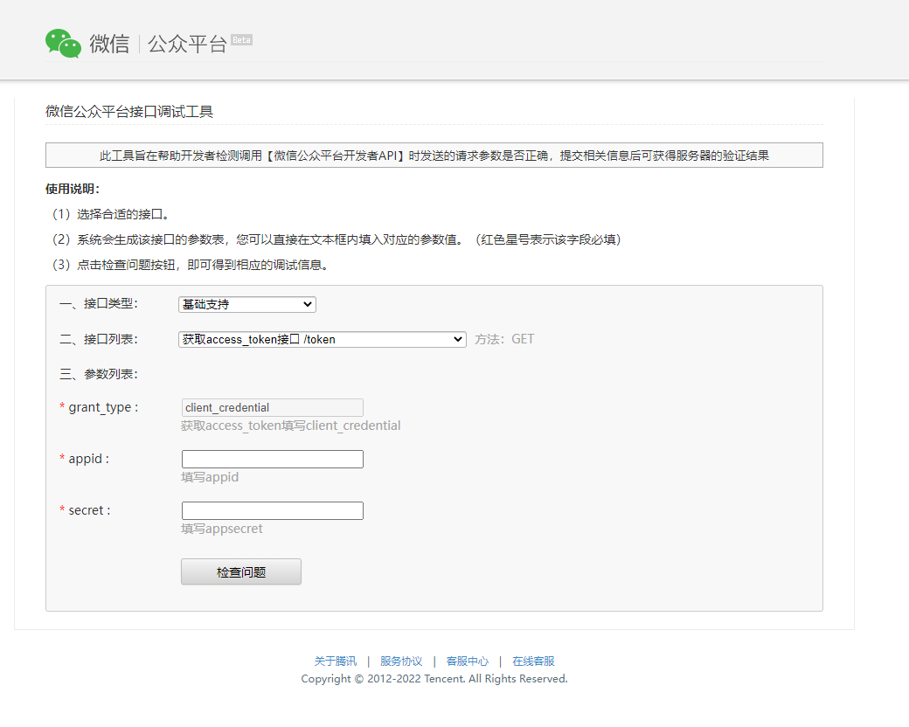

# 微信公众号开发过程记录

## 申请公众号测试号

[测试公众号申请地址](https://mp.weixin.qq.com/debug/cgi-bin/sandbox?t=sandbox/login)

填完以上信息即可完成测试公众号的申请，测试公众号据有正常服务号的功能，具体功能参考以上链接的体验接口权限表。

注意事项：

* 微信需要校验后端服务的可用，接口配置信息填写后端的接口
* token可以随便写，后端代码写上对应的token即可
* js域名安全域名填写前端项目的测试地址即可


## 获取公众号access_token

[微信公众平台接口调试工具](https://mp.weixin.qq.com/debug?token=602053699&lang=zh_CN)

根据以上平台接口调试工具填入相关的信息，调用access_token接口获取 access_token

 

## 创建测试公众号的菜单

获取 access_token 后即可通过以上链接调用创建菜单接口，以下填入具体需要测试的链接即可
```Bash
{
    "button": [
        {
            "name": "生产环境",
            "sub_button": [
                {
                    "type": "view",
                    "name": "壹马XXX",
                    "url": "https://XXXXXXX/home"
                },
                {
                    "type": "view",
                    "name": "江铃XXX",
                    "url": "https://XXXXX/home"
                },
                {
                    "type": "view",
                    "name": "骏派XXX",
                    "url": "https://XXXXXX/home"
                }
            ]
        },
        {
            "name": "测试环境",
            "sub_button": [
                {
                    "type": "view",
                    "name": "车音-XXX",
                    "url": "https://XXXXX/home"
                },
                {
                    "type": "view",
                    "name": "壹马XXX",
                    "url": "https://XXXXXXXXX/home"
                },
                {
                    "type": "view",
                    "name": "江铃XXX",
                    "url": "https://XXXXXXXXX/home"
                },
                {
                    "type": "view",
                    "name": "骏派XXX",
                    "url": "http://XXXXXXXXXXXXXXX/home"
                }
            ]
        }
    ]
}
```

## 用户同意授权，获取code

https://open.weixin.qq.com/connect/oauth2/authorize?appid=APPID&redirect_uri=REDIRECT_URI&response_type=code&scope=SCOPE&state=STATE#wechat_redirect

若提示“该链接无法访问”，请检查参数是否填写错误，是否拥有 scope 参数对应的授权作用域权限。

如果用户同意授权，页面将跳转至 redirect_uri/?code=CODE&state=STATE，在我们具体业务获取 access_token 时候，请求成功时，微信平台会回调reirect_uri配置的地址，并将code追加到路径上。格式为：redirect_uri?code=xxx。

具体参考：

[用户同意授权，获取code](https://developers.weixin.qq.com/doc/offiaccount/OA_Web_Apps/Wechat_webpage_authorization.html#0)

code =》 后端拿到code =》 微信服务器获取 access_token

    《==========   openid、用户信息


