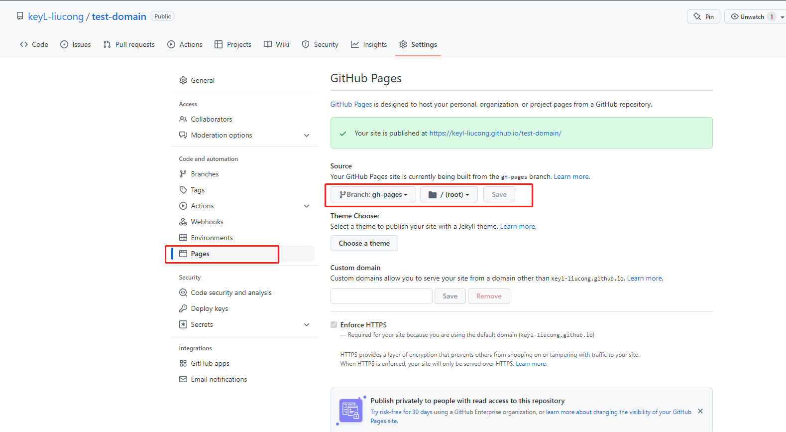
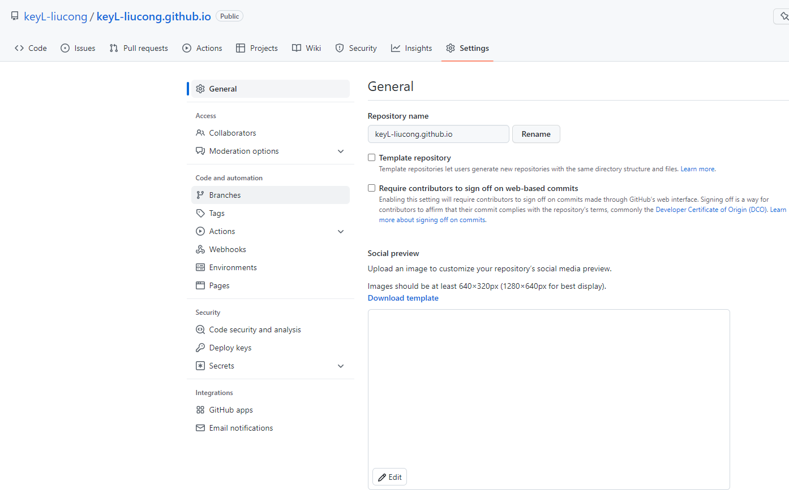
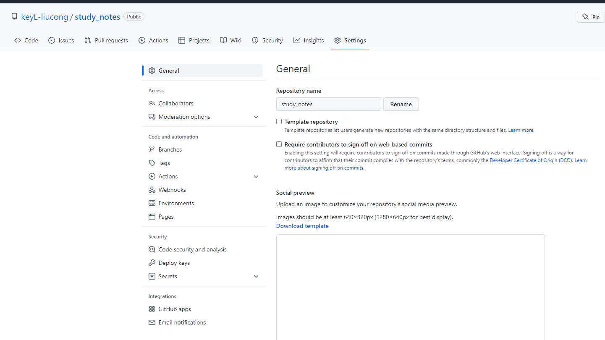
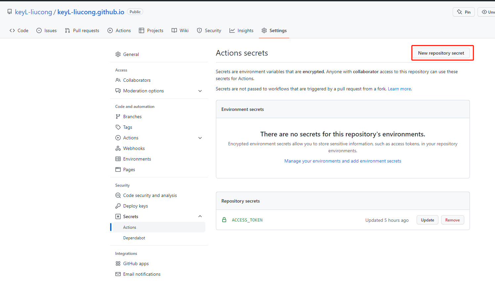
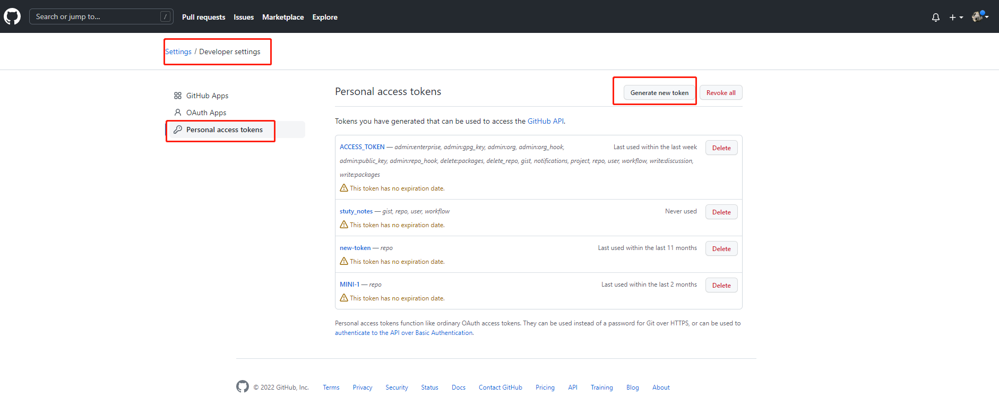

# vuepress

使用 GitHub Actions 将 VuePress 自动部署到 Github Pages。

[参考文章](https://juejin.cn/post/7045099697156915208)

## 需求
搭建属于自己的BLOG。
## github功能介绍
### Github Pages 

github仓库可以托管静态资源，github提供了pages功能, 分别是user pages和project pages, 区别如下:

|     | User Page  |   Project Page  |
|  ----  | ----  |  --- |
| 是否多个  | 一个帐号只有一个 | 可以有多个, 每个repo都可以有对应的Project page |
| repo and branch  | repo名必须为username.github.io, 页面在master上 | repo名随意, 页面必须在分支gh-pages下 |
| URL  | https://username.github.io | https://username.github.io/projectname |

注：username为自己github账号名称。

[github](https://github.com/)

* 创建项目
* 初始化项目
* 创建gh-pages分支，分支存在对应的静态资源文件
* 项目setting => pages 获取 url，如下图
  
[demo](https://keyl-liucong.github.io/test-domain/)

注意事项：设置相应的分支和文件下存在index.html



### GItHub Actions

GItHub Actions是一个持续集成和持续交付的平台，能够让你自动化你的编译、测试和部署流程。

GitHub 提供 Linux、Windows 和 macOS 虚拟机来运行您的工作流程，或者您可以在自己的数据中心或云基础架构中托管自己的自托管运行器。

简而言之，GitHub Actions可以执行项目中的.github/workflows/.yml进行自动化构建过程。

## vuepress

vuepress 是 Vuejs 官方提供的一个是Vue驱动的静态网站生成器，基于Markdown语法生成网页。简单的说它就是一个快速建设文档站点的工具，在简单配置好功能后，需要做的事情就剩下写好一个个 Markdown 文档，并且可以将其发布到github，本文使用vuepress-theme-hope皮肤。

[vuepress中文文档](https://www.vuepress.cn/)

[vuepress-theme-hope-v2](https://vuepress-theme-hope.github.io/v2/)

## 过程

### github创建项目
根据需求，创建User Page 还是创建 Project Page

User Page   username.github.io



Project Page  projectname



### 初始化vuepress项目

拉取上面创建的仓库代码，并初始化创建vuepress-theme-hope项目。注意添加.gitignore 文件忽略node_module等文件

[参考官方教程](https://vuepress-theme-hope.github.io/v2/zh/cookbook/tutorial/env.html)

### 创建github action

在你的仓库中根目录创建一个.github/workflow/[your action name].yml，yml文件名字可以随意写, 以下为yml文件内容
```bash
# action 的名称
name: Deploy

# 触发条件：在 push 到 main 分支后
on:
  push:
    branches:
      - main

# 任务
jobs:
  build-and-deploy:
    # 服务器环境：最新版 Ubuntu
    runs-on: ubuntu-latest
    steps:
      # 拉取代码
      - name: Checkout
        uses: actions/checkout@v2
        with:
          persist-credentials: false

      # 生成静态文件
      - name: Build
        run: npm install && npm run docs:build

      # 部署到 GitHub Pages
      - name: Deploy
        # 使用别人写好的一个 action
        uses: JamesIves/github-pages-deploy-action@releases/v3
        with:
          # 这里的 ACCESS_TOKEN 名字需要和下文中的相对应
          ACCESS_TOKEN: ${{ secrets.ACCESS_TOKEN }}
          # 打包后的文件部署到哪个分支上
          BRANCH: gh-pages
          # 打包后的文件在哪里
          FOLDER: docs/.vuepress/dist
```

### 配置以上.yml文件中ACCESS_TOKEN

为保密安全起见，需在github中配置ACCESS_TOKEN。

repository =》 setting =》 Secrets =》 action =》 New repository secret






参考以下文章即可
[github配置ssh key密钥的方法](https://blog.csdn.net/x550392236/article/details/123069751)


